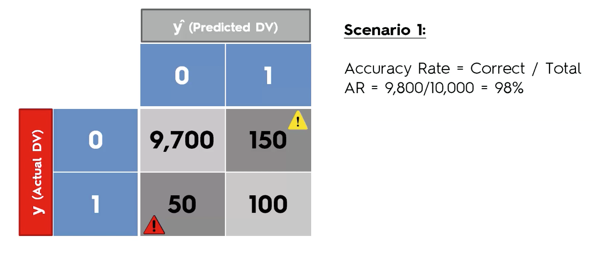
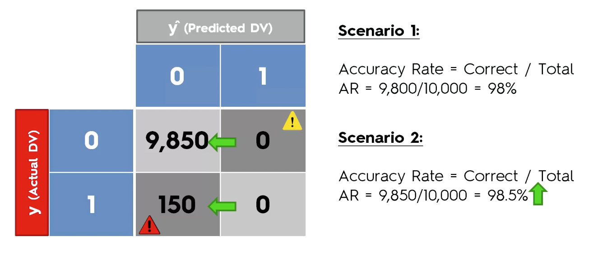

# Predicting Customer Purchases

**Task:**

We currently work within the data science team of an automotive company, who subsidises electric eco-friendly cars to companies. For one of our clients, the company has sent across employee data and whether they have put an order through. Our task is to see whether we can see any trends and produce a machine learning model that can predict whether a customer is likely to purchase the car.   

We will be completing this business task using Logistic Regression, K Nearest Neighbours, Support Vector Machine, Naive Bayes, Classification Trees and XGBoost.

### Confusion Matrix

We will be evaluating our model performance by using the confusion matrix. 

**Type I Error:**

A type I error occurs when we have predicted a positive outcome (1 or yes) but in reality it was negative (0 or no), therefore predicting an effect that did not occur. Type I errors are also referred to as "False Positives".

**Type II Error:**

A type II error occurs when we have predicted a negative outcome (0 or no) but in reality it was positive (1 or yes), therefore an unexpected effect occuring. Type II errors are also referred to as "False Negatives".

Type II errors are deemed more serious that type I errors. This is because there could be dire consequences if we have predicted an event such as an earthquake/disease not occuring, but in fact it did occur; leading to unnecessary injury and fatalities.

The diagram below shows a confusion matrix with the accuracy calculated.

However, we should not rely on the confusion matrix as in some cases we can arrive at the incorrect conclusions.

**Accuracy Paradox**

## Logistic Regression

**Pros of Logistic Regression:**
- Probabilistic approach
- Gives information about statistical significance of features

**Cons of Logistic Regression:**

- Logistic Regression assumptions

**Assumptions of the Logistic Regression:**
- Appropriate outcome structure (Binary logistic regression requires a binary dependent variable, and an ordinal logistic regression requires an ordinal dependent variable)
- Observation independence (The observations are independent of each other)
- Lack of multicollinearity (The independent variables should not be highly correlated with each other)
- Linearity of independent variables and log odds (The independent variables are linearly related to the log odds)
- Large sample size

