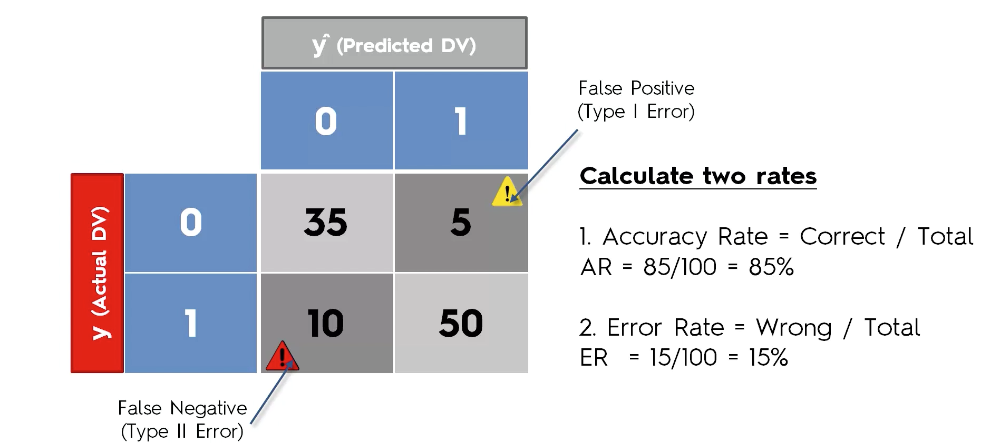
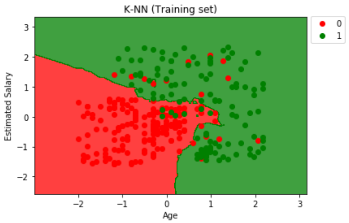
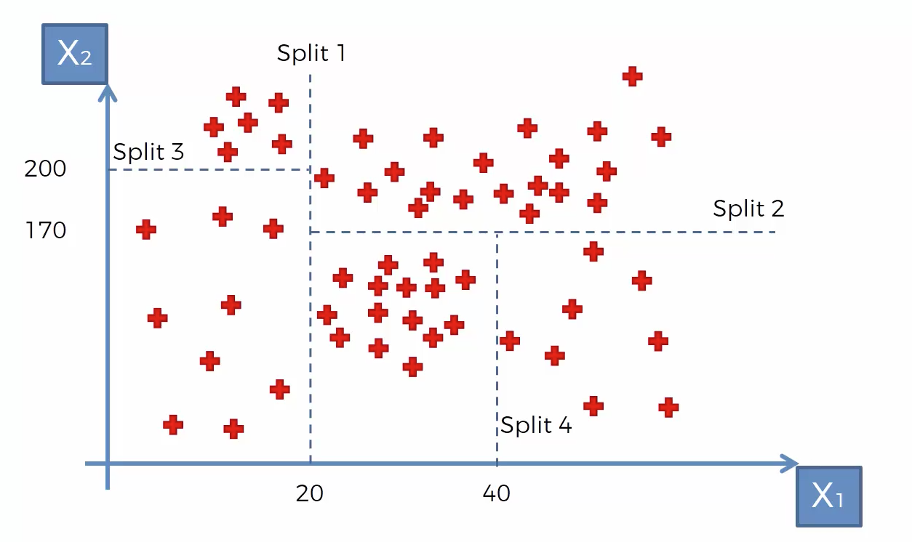
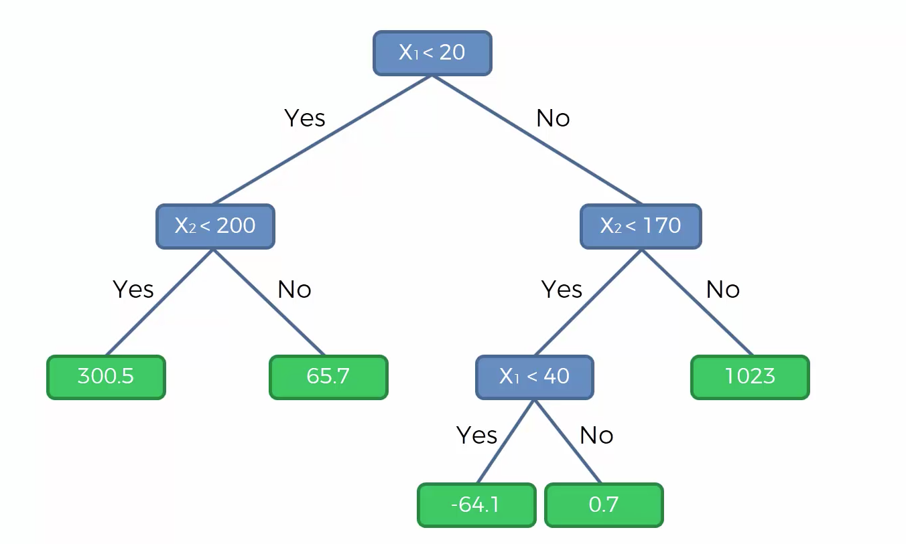

# Predicting Customer Purchases

**Task:**

We currently work within the data science team of an automotive company, who subsidises electric eco-friendly cars to companies. For one of our clients, the company has sent across employee data and whether they have put an order through. Our task is to see whether we can see any trends and produce a machine learning model that can predict whether a customer is likely to purchase the car.   

We will be completing this business task using Logistic Regression, K Nearest Neighbours, Support Vector Machine, Naive Bayes, Classification Trees and XGBoost.

### Confusion Matrix

We will be evaluating our model performance by using the confusion matrix. 

**Type I Error:**

A type I error occurs when we have predicted a positive outcome (1 or yes) but in reality it was negative (0 or no), therefore predicting an effect that did not occur. Type I errors are also referred to as "False Positives".

**Type II Error:**

A type II error occurs when we have predicted a negative outcome (0 or no) but in reality it was positive (1 or yes), therefore an unexpected effect occuring. Type II errors are also referred to as "False Negatives".

Type II errors are deemed more serious than type I errors. This is because there could be dire consequences if we have predicted an event such as an earthquake/disease not occuring, but in fact it did occur; leading to unnecessary injury and fatalities.

The diagram below shows a confusion matrix with the accuracy calculated.

However, we should not rely on the confusion matrix as in some cases we can arrive at the incorrect conclusions.

**Accuracy Paradox**

Let's take a look at the confusion matrix below. Out of our 10,000 predictions only 200 were incorrect, giving us an accuracy of 98%, a very accurate model indeed. 

However, if we abandon the model and set all predictions to 0, we get an accuracy of 98.5% which indicates a better accuracy compared to when using the classification model. The diagram below illustrates this. 

For example, if a business sold the most luxurious products where only a small percentage of the population could afford, setting all predictions to zero would mean the business should shut down and not sell to anyone as this increases model accuracy. This case occurs when there is a very low number of observations that are positive (1 or yes) in comparison to the observations that are negative (0 or no). We should therefore always use the confusion matrix as an indicator of accuracy but apply our logic so we can interpret the confusion matrix and arrive at the correct conclusion.

## Logistic Regression

**Pros of Logistic Regression**
- Probabilistic approach
- Gives information about statistical significance of features

**Cons of Logistic Regression**

- Logistic Regression assumptions

**Assumptions of the Logistic Regression**
- Appropriate outcome structure (Binary logistic regression requires a binary dependent variable, and an ordinal logistic regression requires an ordinal dependent variable)
- Observation independence (The observations are independent of each other)
- Lack of multicollinearity (The independent variables should not be highly correlated with each other)
- Linearity of independent variables and log odds (The independent variables are linearly related to the log odds)
- Large sample size

The diagram below illustrates the training set. The seperate regions (red and green) are called the predictive regions. The line that seperates the regions is called the predictive boundary, this being the logistic regressor which is a linear classifier. We will use the same regions to place the test set values to see how well the prediction performs as the model was trained on the training set (X_train, y_train). 

The diagram below shows us how the logistic regression model performs for predicting the test set values.

The confusion matrix below summarises the above diagram.

From the confusion matrix, we conclude that our model has an accuracy of 89%.

## K Nearest Neighbours

The diagram below illustrates how the KNN algorithm works. We have two classes (A and B) and a new point depicted by the red star. In the first scenario, if we choose the number of k-neighbours to be 3 we observe 2 points from class B and only one from class A, therefore the algorithm will classify the new point as class B. In the second scenario however, if we choose the number of k-neighbours to be 6 we observe 4 points belonging to class A and only 2 points belonging to class B, therefore classifying the new point as class A.

**Steps to perform the KNN algorithm**

- Step 1: Choose the number k of neighbours (usually k = 5)
- Step 2: Take the k nearest neighbours of the new data point, according to the euclidean distance.
- Step 3: Among these k neighbours, count the number of data points in each category.
- Step 4: Assign the new data point to the category where you counted the most neighbours. 

**Pros of K Nearest Neighbours**

- Simple to understand
- Fast and efficient

**Cons of K Nearest Neighbours**

- Need to choose the number of neighbours (n_neighbors = k)

The diagram below shows the KNN algorithm being trainined on the training set.

The diagram below shows us how the KNN model performs for predicting the test set values. 

The confusion matrix below summarises the above diagram.

From the confusion matrix, we conclude that our model has an accuracy of 93%.

## Support Vector Machine - Linear Kernel

The SVM algorithm looks at the very extreme cases, or in other words, the points that are near the boundary of the group, class or studied classification. This is used to construct the analysis which makes the SVM unique in comparison to other machine learning algorithms. The diagram below illustrates how the SVM will linearly seperate two classes.

The predictive boundary (or straight line) seperating the two classes is drawn equidistant between the two extreme vectors (points); we refer to them as "Support Vectors". We call this line the "Maximum Margin Hyperplane". The margin must be maximised in order for the resulting line to be the SVC. They're called vectors as, in the higher dimensions they will be referred to as vectors and not points. The two parallel margin hyperplanes are referred to as the "Positive Hyperplane" and "Negative Hyperplane", the order does not matter.  

**Pros of SVM - Linear Kernel**
- Performant
- Not biased by outliers
- Not sensitive to overfitting

**Cons of SVM - Linear Kernel**
- Not appropriate for non-linear problems
- Not the best choice for a large number of features

The diagram below shows the SVM being trainined on the training set.

The diagram below shows how the SVM model performs for predicting the test set values.

The confusion matrix below summarises the above diagram.

From the confusion matrix, we conclude that our model has an accuracy of 90%.

## Support Vector Machine - Gaussian RBF (Radial Basis Function) Kernel

The diagram below shows two datasets which contain two classes, the first dataset being linearly seperable and the second not being linearly seperable. For the first case we may either use Logistic Regression or SVM with a linear kernel, but for the second case this will fail. Therefore we may use models such as the SVM with the Gaussian RBF Kernel.

**Mapping to a higher-dimensional space**

Lets observe the dataset below. From inspection, we recognise that the data is not linearly seperable.

Let's shift the data points to left by 5 units (X-5), and then square the function. As the data will take a parabolic shape, we now observe the data being linearly seperable with a straight line as shown below. Thus, the data being linearly seperable in a higher-dimensional space. 

For a 2D plane, the data is transformed to a 3D plane and a "Maximum Margin Hyperplane" is used to linearly seperate the data. This is illustrated by the diagram below. 

The 3D space is then projected back onto the original 2D plane, having our non-linear seperator in place. This is illustrated by the diagram below.

However, mapping to a higher dimensional space can be highly compute-intensive (demanding a lot a computation); we therefore use the kernel trick.

**The Kernel Trick**

The diagram below illustrates the Gaussian RBF kernel K(x,l). 

The height of the tip is at the center of the plane (0,0) where the landmark (l) resides, and x being a point on the plane. Sigma (σ) is a fixed parameter that we have fixed earlier. 

**Note**

- The value of sigma (σ) is directly proportional to the size of the decision boundary. The predictive region therefore changes in accordance to sigma (σ).
- || x-l || is the distance between the point and the landmark

Therefore, we do not perform any computations in the higher space. Although the curve is in 3D, we are computing in the 2D. 

The diagram below demonstrates the seperation of the two non-linearly seperable classes and how the seperation regions are formed by the Gaussian RBF kernel.  

**Pros of SVM - Gaussian RBF Kernel**

- High performance on non-linear problems
- Not biased by outliers
- Not sensitive to overfitting

**Cons of SVM - Gaussian RBF Kernel**

- Not the best choice for a large number of features
- More complex than other models

The diagram below shows the SVM being trainined on the training set.

The diagram below shows how the SVM model performs for predicting the test set values.

The confusion matrix below summarises the above diagram.

From the confusion matrix, we conclude that our model has an accuracy of 93%.

## Naive Bayes

Naive Bayes is a probabalistic classifier that predicts which region or class a point belongs to on the basis of its probability. Naive Bayes uses Bayes theorem to decide how to classify a new point, the formula is give below. 

- P(A|B) is the "Posterior Probability"
- P(B|A) is the "Likelihood"
- P(A) is the "Prior Probability"
- P(B) is the "Marginal Likelihood"

E.g. We have a sample of 30 observations that have told us their salary, age and whether they walk or drive to work. We will observe a new point and by using Bayes theorem, we will probabilistically classify which class (predictive region) the new point belongs to. The diagram below is a scatter graph of this scenario and the new point is represented by the yellow star.

We will need to compute the posterior probability P(Walks|X). As we only have two outcomes, we can state that 
P(Walks|X) = 1 - P(Drives|X). 

P(Walks|X) = P(X|Walks) x P(Walks) / P(X)

P(Walks) = The number of walkers / Total observations = 10/30 (prior probability)

P(X) = The number of similar observations / Total observations (marginal likelihood)

The diagram below illustrates the number of similar observations. As there are 4 observations in the circle, we state that P(X) = 4/30.

P(X|Walks) = The number of similar observations among those who walk / Total number of walkers = 3/10 (likelihood)

Therefore the posterior probability P(Walks|X) = (3/10 x 1/3)/(4/30) = 3/4. As P(Drives|X) = 1 - P(Walks|X) = 1/4, we conclude that the new observation will be predicted to be a walker.

This method is named "Naive Bayes" due to Bayes theorem requiring the assumption of variable independence. Bayes theorem is the foundation of the Naive Bayes machine learning algorithm. The variables are likely to have some correlation (i.e. Age and Salary, the older you are the more experience you are likely to have which results in a higher salary). But to assume they are independent is a fundamental requirement which means we are naive, thus Naive Bayes.

**Pros of Naive Bayes**

- Efficient
- Not biased by outliers
- Works on linear and non-linear problems
- Probabilistic approach

**Cons of Naive Bayes**

- Based on the assumption that features have the same statistical relevance

The diagram below shows the Naive Bayes being trainined on the training set.

The diagram below shows how the Naive Bayes model performs for predicting the test set values.

The confusion matrix below summarises the above diagram.

From the confusion matrix, we conclude that our model has an accuracy of 90%.

## Decision Tree 

CART: Classification and Regression Trees

The diagram below illustrates an example of how the Decision Tree Regression works. The small segments are called "terminal leaves".

We take the average of each terminal leaf and the value obtained will be the value predicted for any point that lands in that terminal leaf.

The tree diagram below shows how each new point will be assigned a new predicted value.

**Pros of Decision Tree Classification**

- Interpretability
- Feature scaling not necessary
- Works on both linear and non-linear problems

**Cons of Decision Tree Classification**

- Poor results on too small datasets
- Overfitting can easily occur

 
